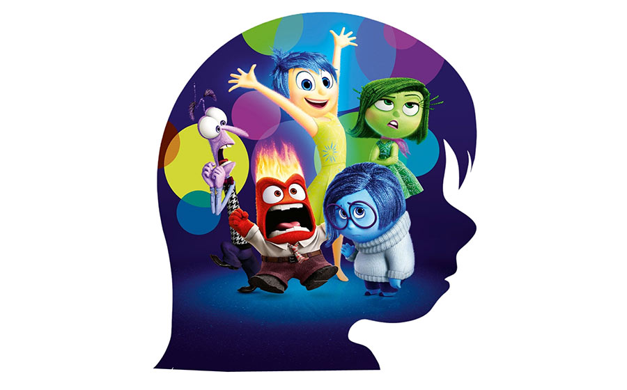

# Divertidamente

     

"Com a mudança para uma nova cidade, as emoções de Riley, que tem apenas 11 anos de idade, ficam extremamente agitadas.  
Uma confusão na sala de controle do seu cérebro deixa a Alegria e a Tristeza de fora, afetando a vida de Riley radicalmente."

Faça um algoritmo que informe:

1. Se a Riley fez novas amizades na cidade, quantas amizades ela fez?  
  Para cada amizade feita pela Riley a emoção Alegria recebe 10 pontos por amizade. 
  Caso ela não tenha feito nenhuma amizade a emoção Tristeza recebe 30 pontos.

2. Na nova cidade, a Riley fez três provas na universidade: A1, A2 e A3.  
  Cada prova vale 10 pontos. Se a média da Riley for maior ou igual a sete, ela esta aprovada e a Alegria recebe 50 pontos. 
  Caso ela não alcance a média a emoção Tristeza recebe 50 pontos.

3. A Riley esta estudando programação.
  E ela tem 10 algoritmos para resolver.  
  Pergunte a Riley quantos exercícios ela conseguiu fazer. 
  Para cada exercício realizado soma-se 10 pontos para a Alegria e para cada não realizado 10 pontos para a Tristeza.

Agora, compare qual emoção possui mais pontos.
Caso a Alegria possua mais pontos que a Tristeza informe na tela:

~~~
A mudança para a nova cidade foi uma experiência incrível para a Riley.
~~~

Caso a Tristeza possua mais pontos informe:
~~~
A mudança para a nova cidade foi uma experiência desagradável para a Riley.
~~~
